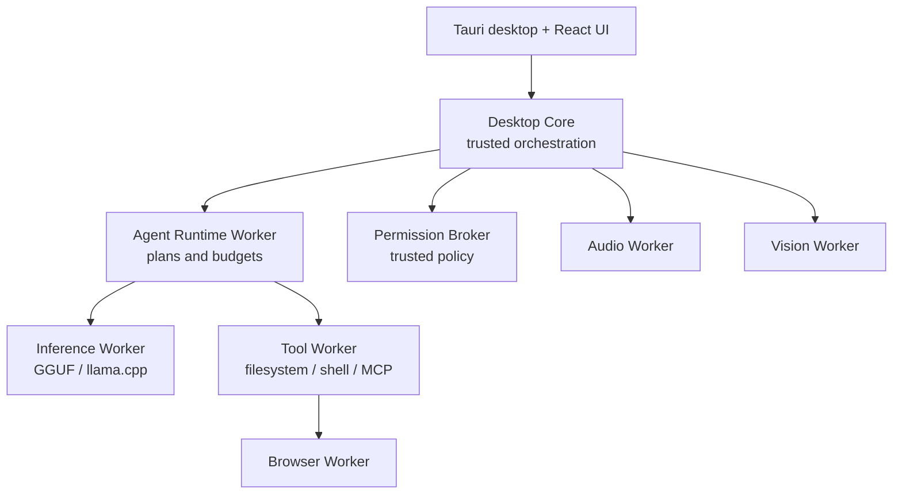
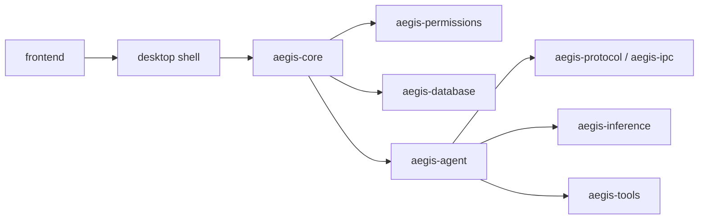
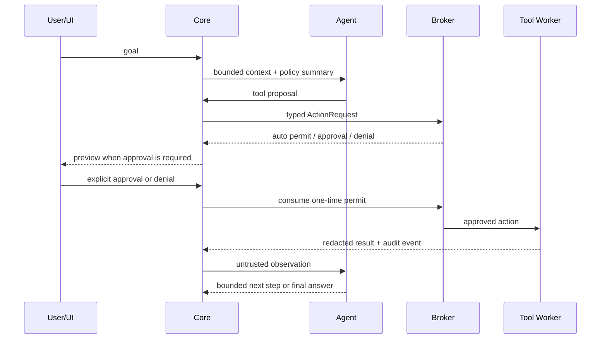

# Aegis AI architecture

Status: Milestone 2b supervised native llama.cpp GGUF runtime, version `0.1.0`.

## A. Product definition

Aegis AI is a Windows 10/11 x64 native desktop AI work environment, not a
chat-only client. It combines local model management, agent orchestration,
permissioned tools, coding workspaces and future voice, vision, browser,
provider and automation capabilities behind stable native contracts.

The product has four non-negotiable properties:

1. **Local-first:** local models, SQLite state and OS-native secret storage are
   the default. Remote providers are explicit, inspectable and optional.
2. **Effect-free model boundary:** a model can emit a proposal, never a host
   side effect. Only the trusted native Permission Broker can authorize an
   execution permit.
3. **Failure containment:** inference, browser, audio and tool execution are
   worker processes. A backend crash must not be the normal path to losing the
   desktop shell or user draft.
4. **Replaceable runtimes:** model format, model architecture, inference
   runtime and accelerator backend are separate concepts.

The initial release deliberately does not pretend to implement computer
control, browser interaction, microphone capture, screen capture, MCP execution,
or a general-purpose tool executor. Aegis now has a supervised native llama.cpp
GGUF runtime, while browser/audio/vision/tool capabilities still require their
own worker, policy, preview, audit and test boundaries. Workspace registration and
model catalog access never grant arbitrary files to a model or agent.

## B. Technology decisions

| Area | Decision | Reason and boundary |
| --- | --- | --- |
| Desktop shell | Tauri 2 | Native WebView shell with a small Rust host and a React frontend. Tauri documents frontend-agnostic integration and `tauri.conf.json`/Vite configuration. See the [official Tauri start guide](https://v2.tauri.app/start/) and [configuration reference](https://v2.tauri.app/reference/config/). |
| Native core | Rust stable, MSVC target | Memory safety, explicit concurrency, good Windows process/IPC support, and strong types at the trust boundary. |
| Frontend | React + TypeScript + Vite | Fast iteration for a dense desktop UI, strict types, controlled rendering and a mature WebView ecosystem. |
| Runtime validation | Zod at the frontend boundary; Serde in Rust | JSON crossing a process or WebView boundary is untrusted input even when the producer is our own code. |
| Async | Tokio + tokio-util cancellation tokens | Structured asynchronous workers, bounded channels and uniform cancellation. |
| Persistence | SQLite via `rusqlite` with bundled SQLite | One user, local-first workload; no server dependency. Foreign keys are enabled per connection and WAL is used for responsive reads/writes. The Tauri shell opens `aegis.sqlite3` in the current user's app-data directory; numbered migrations and repository transactions own durable conversations/workspace scopes. See SQLite's [foreign key](https://www.sqlite.org/foreignkeys.html) and [WAL](https://www.sqlite.org/wal.html) documentation. |
| Secrets | Windows Credential Manager/DPAPI adapter | Secrets never live in JSON, SQLite, logs, model prompts or diagnostic bundles. A platform-neutral trait keeps the core testable. |
| Local inference | Supervised native `llama-server`, first format GGUF | The Tauri shell launches a real llama.cpp server outside the desktop process, passes the revalidated model/profile as an argument vector, waits for `/health`, then reuses the OpenAI-compatible stream/cancel transport. The Windows bundle is built from a pinned upstream commit as a static CPU runtime; a compatible external GPU build can be selected explicitly. |
| AMD path | Vulkan first | It is the first-class Windows path for the RX 5700 XT target without making ROCm a hard prerequisite. Vulkan capability and driver behavior are detected, not assumed. |
| NVIDIA path | CUDA adapter later | Added as another worker backend; no UI or agent changes. |
| Remote models | OpenAI-compatible provider adapter | Remote use remains an explicit provider with a visible data route and per-provider secret reference. |
| Tool interoperability | MCP adapter in a separate worker | MCP discovery and calls are normalized into Aegis manifests and still pass through the local broker. MCP's own security guidance recommends clear tool visibility and a human ability to deny calls; see the [official tools specification](https://modelcontextprotocol.io/specification/2025-06-18/server/tools). |
| Browser | Playwright/browser worker later | Browser state and hostile web content never enter the trusted core as instructions. |
| Audio | Independent STT/TTS worker later | whisper.cpp/Piper-like adapters can be swapped without changing chat or agent contracts. |

### Alternatives considered

- **Electron:** technically viable, but its always-on Chromium process model is
  a poor default for an idle, local-first application. It is not needed for the
  React UI or the native worker model.
- **WinUI 3:** lower shell overhead and deep Windows integration are attractive,
  but it couples the product to a second UI stack and makes the planned plugin
  panel ecosystem less portable. It remains a possible Windows-specific shell
  if profiling later shows WebView2 to be the limiting factor.
- **Embedding llama.cpp in the main Rust process:** rejected. A native backend
  or driver failure has too much blast radius. It may be embedded inside the
  inference worker in a later optimization without changing the core contract.
- **Local TCP for all IPC:** rejected as the default. Windows named pipes with
  user ACLs and inherited stdio handles have a smaller local attack surface.
  Loopback HTTP is reserved for an explicitly enabled, authenticated local API.
- **Vector database in the first milestone:** rejected. It adds storage and
  dependency weight before the model/chat/workspace primitives exist. RAG gets
  an adapter after retrieval needs are measured.

## C. Process and worker topology



### Trust and failure boundaries

- The **desktop core** owns policy, persistence coordination, worker lifecycle,
  typed command routing and user-visible state. It does not parse arbitrary
  model output as executable instructions.
- The **agent worker** can plan and request tool calls, but has no OS handle for
  direct execution and receives no broker policy secret.
- The **inference worker** owns the native backend. It has no permission to
  launch tools, write workspace files or control input devices.
- The **tool worker** runs approved operations only. It receives a one-time
  permit and revalidates the action immediately before its effect.
- Browser, audio and vision workers are disabled until their device/network
  permission is active. Their output is typed data marked untrusted where it
  originated outside the core.

### IPC

The default production transport is a per-launch Windows named pipe with a
current-user ACL. The core creates the pipe and spawns the worker; a fresh
per-worker session key and challenge are used for handshake authentication.
Development on non-Windows uses a Unix domain socket. Worker messages use a
versioned `Frame<T>` envelope, a typed payload, request ID, monotonic sequence
and HMAC tag. No unauthenticated LAN listener is used for worker IPC.

The optional OpenAI-compatible API is a separate, opt-in loopback service:
`127.0.0.1` by default, an authentication key required, CORS allowlist narrow,
and `0.0.0.0` only after an explicit user setting.

## D. Module boundaries



Provider, audio and vision crates will implement contracts against `protocol`
and `core` events, not import the frontend. The dependency direction is
deliberately boring: domain contracts at the bottom, orchestration in the
middle, presentation at the top.

## E. Request and execution data flow



The context builder places tool/browser/document output in a distinct untrusted
content envelope. It cannot become a system or developer message merely by
containing text such as “ignore previous instructions”.

## E.1 M1b persistence and workspace registry

The native shell creates the database before registering Tauri commands. The
repository layer exposes typed `ConversationRecord`, `MessageRecord` and
`WorkspaceRecord` values; it never accepts provider secrets. Conversation saves
are transactional snapshots: the conversation row and its message rows commit
together, while message reasoning is stored as a first-class nullable column.
Foreign keys keep message deletion coupled to its conversation.

Workspace registration is intentionally narrower than workspace access. The shell
may perform a read-only `metadata`/canonicalization check on a user-supplied
directory and store the resulting named scope. No file is opened, copied or
executed by this feature. Future tools must bind an action to a registered scope,
request a broker permit and revalidate the path immediately before execution.

The frontend validates every native response with Zod and falls back to
localStorage only when the Tauri bridge is unavailable in development preview.

### Local GGUF catalog and load preflight

The desktop shell exposes an explicit, user-initiated model-library workflow.
A registered root is canonicalized and scanned deterministically without following
symlinks. The scanner reads GGUF magic/version and metadata only; it never opens
tensor data or executes a model. A malformed file becomes a bounded issue while
valid files remain in the SQLite snapshot.

The parser limits metadata keys to 4,096, strings to 1 MiB, arrays to 16,384
items, nesting to eight levels, metadata input to 8 MiB and serialized metadata
to 4 MiB. Directory traversal is limited to depth eight and 2,048 files. These
limits apply before metadata is persisted or returned over Tauri IPC.

Selecting a model re-inspects the file and verifies its size and metadata hash
before estimating a saved Eco, Balanced or Performance profile. Context capacity
and resource limits are validated against the model descriptor. Weight, KV-cache,
RAM and VRAM values include a confidence label and are advisory before load. The
separate native runtime path then launches `llama-server`, so **Ready** means the
process accepted the GGUF and exposed `/health`; it does not invent GPU/VRAM
telemetry that the runtime has not reported.

## F. Inference architecture

The following are independent persisted/runtime concepts:

```text
ModelDescriptor    = what the model file is and what it advertises
RuntimeDescriptor  = which runtime can load it and at which version
BackendDescriptor  = which accelerator/backend implementation is available
LoadProfile        = the requested resource/performance policy
```

The first `InferenceBackend` contract exposes:

- `load_model` / `unload_model`
- `generate` through bounded token events
- `tokenize` / `detokenize`
- `get_model_info`
- `get_memory_estimate`
- `cancel_generation`
- `get_runtime_metrics`

Each backend reports capability flags rather than letting the UI infer them
from a name. The current native llama.cpp launch sequence is:

1. Re-inspect the cataloged GGUF and require its absolute path, exact size and
   metadata hash to match the selected model record.
2. Match `ModelDescriptor` to the selected `LoadProfile`; reject unsupported
   context, cache or offload values before spawning a process.
3. Resolve the bundled pinned runtime, an explicit executable or a PATH command.
   Reserve a random `127.0.0.1` port and pass all settings as an argument vector.
4. Start `llama-server` outside the Tauri process and poll `/health`: 503/loading
   is not ready, while a successful response is the real tensor-load gate.
5. Reuse the OpenAI-compatible `/v1` client for streaming, reasoning, usage and
   cancellation; the process watchdog turns an unexpected exit into an error.
6. On unload, cancellation of startup or application drop, kill and wait for the
   child process so a native server cannot remain orphaned.

The current M2b path uses loopback HTTP because it is the API exposed by the
official server. Agent/tool workers continue to use the authenticated named-pipe
IPC boundary described above; they do not receive the native server's authority.

For the RX 5700 XT target, Vulkan is the preferred detected backend. A model
larger than VRAM may use CPU/GPU split when the backend advertises it. No
silent fallback to a remote provider is allowed. ROCm is an optional future
adapter and is not assumed to be available on Windows.

### Load profiles

`Eco`, `Balanced`, `Performance` and `Custom` are policy presets. The UI shows
only the important controls first; advanced fields remain typed in the profile:
context, GPU offload, CPU threads, batch sizes, flash attention, KV offload,
K/V cache quantization, mmap/mlock, parallel requests, reasoning budget and
sampling. The preset is never allowed to bypass memory validation.

### Resource and thermal telemetry

Actual worker/runtime metrics are distinct from estimates. The native M2b
supervisor enables llama.cpp's Prometheus metrics endpoint and polls it through
a bounded response reader. Known prompt/prediction counters, throughput gauges,
active/deferred request counts and the observed context high-watermark are
validated and surfaced in the bilingual runtime panel. Missing telemetry is
represented as unavailable, never as zero. Device-specific VRAM/RAM, CPU/GPU
load, temperature, power and joules/generated-token remain unavailable unless
the selected runtime exposes a trustworthy source. A thermal-aware policy may
later lower concurrency or context; it never changes clocks, power limits, fan
curves or voltage without a separate user-approved native feature.

## G. Permission Broker design

The broker is a trusted native-core service. It is not a prompt, system message,
model tool or editable JSON policy. No agent or model-facing API can mutate its
policy or approve its own request.

### Action lifecycle

1. A tool creates a typed `ActionRequest` from validated input.
2. The broker validates required capabilities, path scope, risk and limits.
3. A read-only request that is inside an explicitly opened workspace may be
   auto-approved by policy; it is still audited.
4. A side effect returns a human-readable `ActionPreview` and a short-lived
   approval ID. The UI shows command/path/network/effect information.
5. An explicit UI approval creates a one-time `ExecutionPermit` bound to the
   exact request digest. Editing the request invalidates the permit.
6. The worker consumes the permit immediately before execution. A permit cannot
   be reused, replayed, expired or transferred to a different action.
7. The result and duration are written to the redacted audit stream.

### Default decision matrix

| Category | Default behavior |
| --- | --- |
| `system.info` | Auto-allow; no side effect |
| Read inside selected workspace | Auto-allow only when the workspace session policy enables it |
| Read outside workspace | Deny or ask for a separately scoped grant; never implicit |
| Write/overwrite, process start, network side effect | Ask every time by default |
| Delete, process kill, install/uninstall, upload, git push, input injection | Ask; strict mode can force every instance |
| Policy/secret/permission mutation | No model-facing capability; native settings UI only |

The high/critical categories stay non-persistent in strict mode. “Always allow”
is a convenience for safe, low-risk scopes, not a bypass around destructive
protection.

## H. Tool security model

Every tool has a versioned manifest containing `id`, display metadata,
capabilities, input/output schemas, risk level, trust origin and limits. The
executor is separate from the model and receives a permit, not a policy.

Required controls:

- JSON schema validation before preview and again before execution; returned
  envelopes are size-limited and checked against the declared output schema.
- No shell by default. Command tools use an executable plus an argument vector;
  shell interpretation is a separate high-risk capability.
- Workspace path policy with absolute-path requirements, canonicalization,
  reparse-point/symlink checks and an immediate pre-execution revalidation.
- Bounded stdout/stderr, response bytes, recursion, duration and process count.
- Environment values are allowlisted; secrets are references resolved only in
  the executor and never returned to the model or audit log.
- HTML, Markdown, browser pages, documents, email and provider results enter as
  `UntrustedContent` with source, timestamp and content hash. They are not
  eligible to modify system/developer instructions or permission policy.
- Every action has an audit event, including denial, cancellation and worker
  failure.

MCP servers are treated like external plugins: separate process, explicit
  server identity, capability review, time/output limits, tool manifest
  normalization and broker approval. The MCP server never gets the desktop
  process's broker credentials.

## I. Plugin architecture

Plugins implement versioned contracts:

- `InferenceBackendPlugin`
- `ToolPlugin`
- `DataProviderPlugin`
- `PanelPlugin`
- `AgentPlugin`
- `AudioPlugin`
- `VisionPlugin`
- `TelemetryPlugin`

The host loads a manifest first, checks `api_major`, supported capabilities,
package hash, signature policy and declared permissions, then starts the plugin
out of process. A major API mismatch is a controlled rejection. A plugin cannot
link to the trusted core's private types or call an unscoped OS API.

The preferred sandbox order is:

1. WASM component with a narrow host capability interface for pure logic.
2. Separate process with named-pipe/stdio IPC and a broker-issued permit for
   native or device-bound plugins.
3. In-process native plugin only after an explicit, advanced developer mode;
   never for ordinary marketplace/plugin installs.

See [PLUGIN_API.md](PLUGIN_API.md) for the initial manifest and compatibility
rules.

## J. SQLite schema

SQLite stores metadata and bounded text. Large attachments, model files, raw
logs and diagnostic archives are external files addressed by a content hash.

| Table | Purpose | Important relations |
| --- | --- | --- |
| `schema_migrations` | Versioned migrations | — |
| `settings` | Global/workspace-scoped non-secret settings | `scope` + non-null `scope_id` |
| `workspaces` | Explicit AI filesystem roots | referenced by projects/conversations |
| `projects` | Coding/project views | `workspace_id` |
| `conversations` | Chat/agent threads and branches | `workspace_id`, `agent_profile_id`, `parent_id` |
| `messages` | system/developer/user/assistant/tool metadata | `conversation_id` |
| `attachments` | External content references | `message_id` |
| `model_libraries` | User-selected model roots | — |
| `models` | Parsed GGUF/runtime metadata and estimates | `library_id` |
| `model_profiles` | Eco/Balanced/Performance/Custom settings | `model_id` optional |
| `agent_profiles` | Persona, model, memory and default policy references | — |
| `permission_grants` | User grants with scope/expiry | never stores secrets |
| `audit_events` | Redacted action lifecycle | conversation/agent/tool IDs |
| `providers` | Provider metadata and OS secret references | — |
| `automations` | Event rules and visible schedule state | provider/event source IDs |
| `plugins` | Installed manifest and trust state | — |
| `event_sources` | Weather/earthquake/etc. normalized sources | — |

All migrations enable foreign keys. Database opening sets WAL, busy timeout
and a conservative synchronous mode. Schema migration is transactional and
refuses to silently skip an unknown version.

## K. Threat model

### Assets

User files and credentials, workspace source code, conversation history,
microphone/camera/screen data, local model files, network identity, permission
policy, audit integrity and application availability.

### Adversaries and controls

| Threat | Boundary/control | Residual risk |
| --- | --- | --- |
| Prompt injection in web/document/tool output | Untrusted content envelope; trusted policy outside context | Model may still produce a risky proposal; broker must deny/ask |
| Malicious or compromised MCP server | Separate process, manifest normalization, broker, quotas and audit | Native server vulnerabilities still require OS patching and user trust |
| Path traversal/symlink/junction escape | Absolute paths, canonical roots, reparse-point checks, pre-execution validation | TOCTOU requires Windows handle-based no-follow implementation in tool worker |
| Command injection | Argument-vector execution by default; shell is separate high-risk capability | A permitted shell command can still be harmful; preview and strict mode matter |
| Inference segfault/driver reset | Separate worker, watchdog, cancellation and restart state machine | A GPU driver reset can affect unrelated Windows applications |
| IPC spoofing/replay | Named-pipe ACL, per-launch key, challenge/HMAC, request IDs and expiry | Host compromise defeats same-user IPC assumptions |
| Secret leakage | OS secret store, redaction, no secret prompt/log path, diagnostic review | Provider/model code can still exfiltrate data if user grants network access |
| Malformed GGUF metadata | Size/type/recursion limits and parser isolation | Native parser bugs remain a backend supply-chain risk |
| XSS/HTML injection | Strict CSP, escaped rendering, no raw HTML for untrusted output | WebView/third-party renderer vulnerabilities require updates |
| Hidden device capture | Explicit device state, visible indicators, default OFF, emergency stop | A compromised OS/driver is outside application control |
| Runaway agent loop | step/token/tool/time budgets, duplicate detection, cancellation | A bounded agent can still make one harmful approved action |
| Corrupt update/plugin | Signed release/package policy, checksums, rollback and quarantine | Signing key compromise is a release-process risk |

### Security invariants tested in code

- A tool call without an approval or an auto-approved safe scope cannot produce
  an execution permit.
- A permit is bound to a request digest, expires and is single-use.
- A workspace read outside the canonical workspace root is rejected.
- Agent policy cannot be changed by a model-facing type.
- External content is typed as untrusted output and is not a system prompt type.

## L. Repository tree

```text
.
├── apps/desktop/src-tauri/       # Tauri shell and native command bridge
├── crates/
│   ├── agent/                    # bounded planner/loop state
│   ├── core/                     # application orchestration and cancellation
│   ├── database/                 # SQLite connection and migrations
│   ├── inference/                # backend/model/profile contracts
│   ├── ipc/                      # authenticated frame helpers
│   ├── providers/                # OpenAI-compatible streaming adapters
│   ├── permissions/              # trusted broker and path policy
│   ├── protocol/                 # versioned wire primitives
│   └── tools/                    # manifests, executor and untrusted output types
├── frontend/                     # React + TypeScript UI
├── workers/worker-host/           # worker lifecycle bootstrap
├── docs/                         # deeper design notes and ADRs
├── tests/                        # cross-crate/security test fixtures
├── ARCHITECTURE.md
├── SECURITY.md
├── PLUGIN_API.md
├── DEVELOPMENT.md
└── THIRD_PARTY_LICENSES.md
```

## M. Milestone plan

| Milestone | Scope | Exit criteria |
| --- | --- | --- |
| M0 | Architecture, threat model, repo, CI shape, desktop shell, typed contracts, broker core | Shell builds; broker/database/protocol tests pass; no execution path exists |
| M1a | Chat UI, OpenAI-compatible local provider, typed streaming events, connection diagnostics and session settings | Ollama/LM Studio-compatible endpoint can stream/cancel; provider, SSE and security tests pass |
| M1b | SQLite conversation repositories, reasoning preservation and workspace registry | Conversations and named scopes survive restart; workspace registration is read-only and broker-free |
| M2a | Bounded GGUF library scan, metadata inventory, persisted model profiles and load preflight | Canonical roots scan safely; corrupt files are reported; profile estimates validate against model capacity |
| M2b | Supervised native llama.cpp GGUF tensor runtime | Pinned Windows runtime builds; Tauri owns start/stop; model hash is rechecked; `/health` gates Ready; bilingual UI routes loopback streaming |
| M3 | Tool runtime, broker UI, audit log, filesystem read, safe shell proposal | Approval is required for every side effect and is integration-tested |
| M4 | Coding workspace, project search, diff/edit flow, Git state, bounded coding agent | Write/test actions require separate previews and approvals |
| M5 | MCP, search provider, browser worker and citations | Untrusted web content cannot alter policy; citations reference fetched sources |
| M6 | Audio worker, VAD, streaming STT/TTS, barge-in | Mic state is always visible and capture is default OFF |
| M7 | Screen/region capture, adaptive vision sampling and emergency stop | No capture without explicit session; live indicator and cancellation tested |
| M8 | Event engine, weather/earthquake providers, scheduler and notifications | Sources/update times visible; automations are inspectable and cancellable |
| M9 | Plugin SDK, WASM/process host, routing, custom architectures, signed runtime updates | Compatibility and sandbox policy tested across plugin versions |

M0, M1a, M1b, M2a and M2b are implemented product foundations. M2b adds the
real native llama.cpp tensor-loading boundary described above. Vulkan/GPU
capability detection, adaptive offload telemetry, tool execution and the other
worker-backed capabilities remain subsequent integration boundaries.

## N. Highest technical risks

1. **AMD Vulkan variability:** driver versions, Vulkan memory behavior and
   llama.cpp backend changes can make estimates and throughput unstable. Mitigate
   with capability detection, a benchmark suite and a versioned runtime manager.
2. **Windows path semantics:** junctions, reparse points and TOCTOU require
   native handle-based validation in the tool worker; lexical path checks alone
   are insufficient.
3. **Worker packaging:** the pinned CPU runtime, optional external GPU runtimes,
   upstream notices and package hashes must remain versioned, restartable and
   distributable without making the installer unexpectedly huge.
4. **Native backend safety:** malformed model metadata and driver crashes remain
   higher-risk than ordinary Rust code. Keep parsers/workers isolated and fuzz
   the GGUF boundary.
5. **Plugin/MCP trust:** process isolation reduces blast radius but does not make
   an untrusted plugin safe after a user grants broad capabilities. Capability
   UX and strict defaults are product-critical.
6. **Streaming UI cost:** long Markdown and tool traces need event batching,
   virtualization and bounded state; otherwise the UI becomes the bottleneck.
7. **Voice/vision resource pressure:** live capture competes with inference for
   VRAM/CPU. Scheduling and thermal telemetry must be explicit, not hidden
   background polling.

## O. Implemented foundation and M1a files

### Workspace and documentation

- workspace manifest, toolchain and formatting configuration
- CI workflow configuration
- `scripts/build-windows.ps1` release verification/build entrypoint
- `scripts/build-llama-runtime.ps1` pinned llama.cpp source build
- `apps/desktop/src-tauri/runtime/README.md` runtime selection and packaging notes
- `README.md`, `ARCHITECTURE.md`, `SECURITY.md`, `PLUGIN_API.md`,
  `DEVELOPMENT.md`, `THIRD_PARTY_LICENSES.md`
- `package.json`, frontend and desktop package manifests/lockfiles

### Rust contracts and core

- `crates/protocol/src/lib.rs`
- `crates/ipc/src/lib.rs`
- `crates/permissions/src/lib.rs`
- `crates/tools/src/lib.rs`
- `crates/inference/src/lib.rs`
- `crates/inference/src/llama_server.rs`
- `crates/providers/src/lib.rs`
- `crates/agent/src/lib.rs`
- `crates/database/src/lib.rs`
- `crates/database/migrations/0001_initial.sql`
- `crates/core/src/lib.rs`
- `workers/worker-host/src/main.rs`

### Desktop and frontend

- `apps/desktop/src-tauri/Cargo.toml`
- `apps/desktop/src-tauri/build.rs`
- `apps/desktop/src-tauri/tauri.conf.json`
- `apps/desktop/src-tauri/capabilities/default.json`
- `apps/desktop/src-tauri/src/main.rs`
- `apps/desktop/src-tauri/src/lib.rs`
- `frontend/package.json`, `frontend/tsconfig.json`, `frontend/vite.config.ts`,
  `frontend/index.html`
- `frontend/src/main.tsx`, `frontend/src/App.tsx`, `frontend/src/ipc.ts`,
  `frontend/src/protocol.ts`, `frontend/src/styles.css`, `frontend/src/chat.css`
- `apps/desktop/src-tauri/icons/icon.ico`,
  `frontend/src/vite-env.d.ts`
